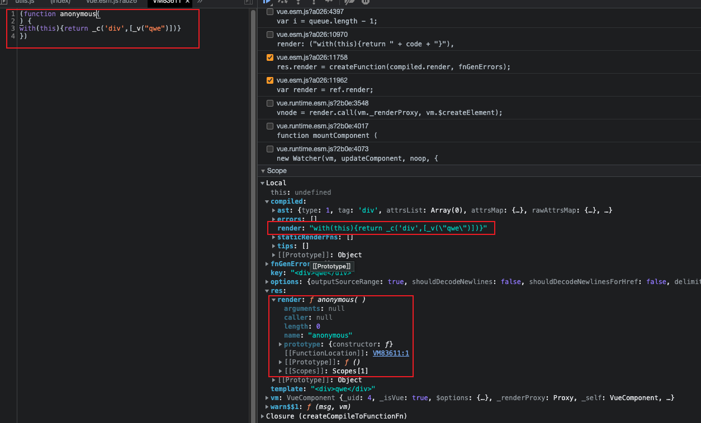

### 模版编译
找到`compiler`版本的代码：
```js
const { render, staticRenderFns } = compileToFunctions(template, {
  outputSourceRange: process.env.NODE_ENV !== 'production',
  shouldDecodeNewlines,
  shouldDecodeNewlinesForHref,
  delimiters: options.delimiters,
  comments: options.comments
}, this)
```
`render`函数通过`compileToFunctions`得到，这个函数的第一个参数为`template`，是代表模版的字符串，第二个参数为基本配置，之后会展开说明，第三个参数是当前组件实例

`compileToFunctions`的定义在`src/platforms/web/compiler/index.js`
```js
import { baseOptions } from './options'
import { createCompiler } from 'compiler/index'

const { compile, compileToFunctions } = createCompiler(baseOptions)

export { compile, compileToFunctions }
```
`createCompiler`接受一个参数`baseOptions`
```js
import {
  isPreTag,
  mustUseProp,
  isReservedTag,
  getTagNamespace
} from '../util/index'

import modules from './modules/index'
import directives from './directives/index'
import { genStaticKeys } from 'shared/util'
import { isUnaryTag, canBeLeftOpenTag } from './util'

export const baseOptions: CompilerOptions = {
  expectHTML: true,
  modules,
  directives,
  isPreTag,
  isUnaryTag,
  mustUseProp,
  canBeLeftOpenTag,
  isReservedTag,
  getTagNamespace,
  staticKeys: genStaticKeys(modules)
}
```
这会在使用的时候讲到

那么`createCompiler`函数是什么样的呢？他定义在`src/compiler/index.js`:
```js
import { parse } from './parser/index'
import { optimize } from './optimizer'
import { generate } from './codegen/index'
import { createCompilerCreator } from './create-compiler'

// `createCompilerCreator` allows creating compilers that use alternative
// parser/optimizer/codegen, e.g the SSR optimizing compiler.
// Here we just export a default compiler using the default parts.
export const createCompiler = createCompilerCreator(function baseCompile (
  template: string,
  options: CompilerOptions
): CompiledResult {
  const ast = parse(template.trim(), options)
  if (options.optimize !== false) {
    optimize(ast, options)
  }
  const code = generate(ast, options)
  return {
    ast,
    render: code.render,
    staticRenderFns: code.staticRenderFns
  }
})
```
可以看到`createCompiler`函数是`createCompilerCreator`函数的返回值，`createCompilerCreator`函数有一个名为`baseCompile`的函数作为参数
`baseCompile`接收两个参数：`template`-模版字符串和`options`编译配置，然后通过`parse`得到`ast`，然后优化`ast`，最后通过`generate`得到`render函数`

找到`createCompilerCreator`的代码，在`src/compiler/create-compiler.js`:
```js
import { extend } from 'shared/util'
import { detectErrors } from './error-detector'
import { createCompileToFunctionFn } from './to-function'

export function createCompilerCreator (baseCompile: Function): Function {
  return function createCompiler (baseOptions: CompilerOptions) {
    function compile (
      template: string,
      options?: CompilerOptions
    ): CompiledResult {
      const finalOptions = Object.create(baseOptions)
      const errors = []
      const tips = []

      let warn = (msg, range, tip) => {
        (tip ? tips : errors).push(msg)
      }

      if (options) {
        if (options.modules) {
          finalOptions.modules =
            (baseOptions.modules || []).concat(options.modules)
        }
        // merge custom directives
        if (options.directives) {
          finalOptions.directives = extend(
            Object.create(baseOptions.directives || null),
            options.directives
          )
        }
        // copy other options
        for (const key in options) {
          if (key !== 'modules' && key !== 'directives') {
            finalOptions[key] = options[key]
          }
        }
      }

      finalOptions.warn = warn

      const compiled = baseCompile(template.trim(), finalOptions)
      compiled.errors = errors
      compiled.tips = tips
      return compiled
    }

    return {
      compile,
      compileToFunctions: createCompileToFunctionFn(compile)
    }
  }
}
```
`createCompilerCreator`函数的返回值就是真正的`createCompiler`
创建`baseCompiler`函数这一段比较绕，初看可能会有点迷糊，这么做的原因是为了兼容不同平台的`baseOptions`，我们只要把这里的`baseCompiler`替换掉外层的同名函数绕过这一段逻辑就能清晰很多

`createCompiler`的返回值包括两个属性：`compile`函数和通过`createCompileToFunctionFn`处理过的`compile`函数

`createCompileToFunctionFn`的定义在`src/compiler/to-function.js`:
```js
export function createCompileToFunctionFn (compile: Function): Function {
  const cache = Object.create(null)

  return function compileToFunctions (
    template: string,
    options?: CompilerOptions,
    vm?: Component
  ): CompiledFunctionResult {
    options = extend({}, options)
    const warn = options.warn || baseWarn
    delete options.warn


    // check cache
    const key = options.delimiters
      ? String(options.delimiters) + template
      : template
    if (cache[key]) {
      return cache[key]
    }

    // compile
    const compiled = compile(template, options)

    // turn code into functions
    const res = {}
    const fnGenErrors = []
    res.render = createFunction(compiled.render, fnGenErrors)
    res.staticRenderFns = compiled.staticRenderFns.map(code => {
      return createFunction(code, fnGenErrors)
    })

    return (cache[key] = res)
  }
}
```
这是因为默认的`render`是一个字符串，`to-function`将其转换为`render`函数，还做了缓存优化
`createFunction`只是新建了一个函数
```js
function createFunction (code, errors) {
  try {
    return new Function(code)
  } catch (err) {
    errors.push({ err, code })
    return noop
  }
}
```

可以看到`render`的区别

回到`compile`函数，前半部分合并配置得到`finalOptions`，然后执行`baseCompile`得到编译结果并返回
`baseCompile`之前已经简单的分析过，主要就进行了三步操作：
1. 解析模版字符串获得抽象语法树
2. 优化语法树
3. 生成代码

接下来分析这几个步骤


