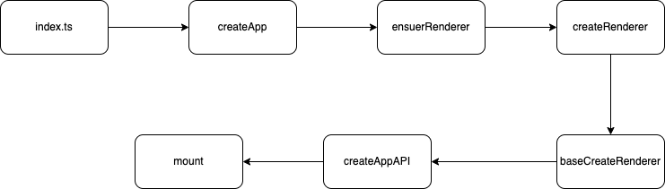
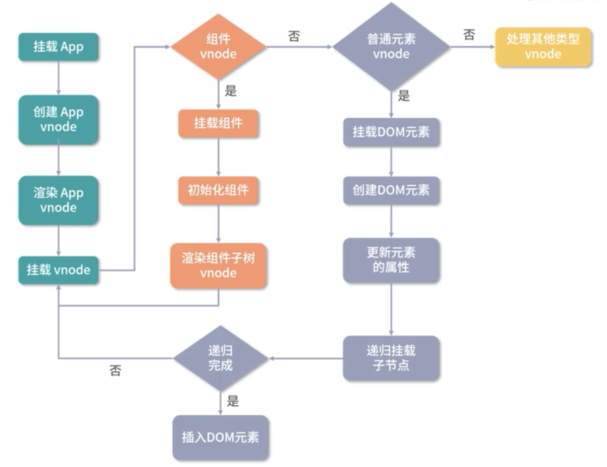
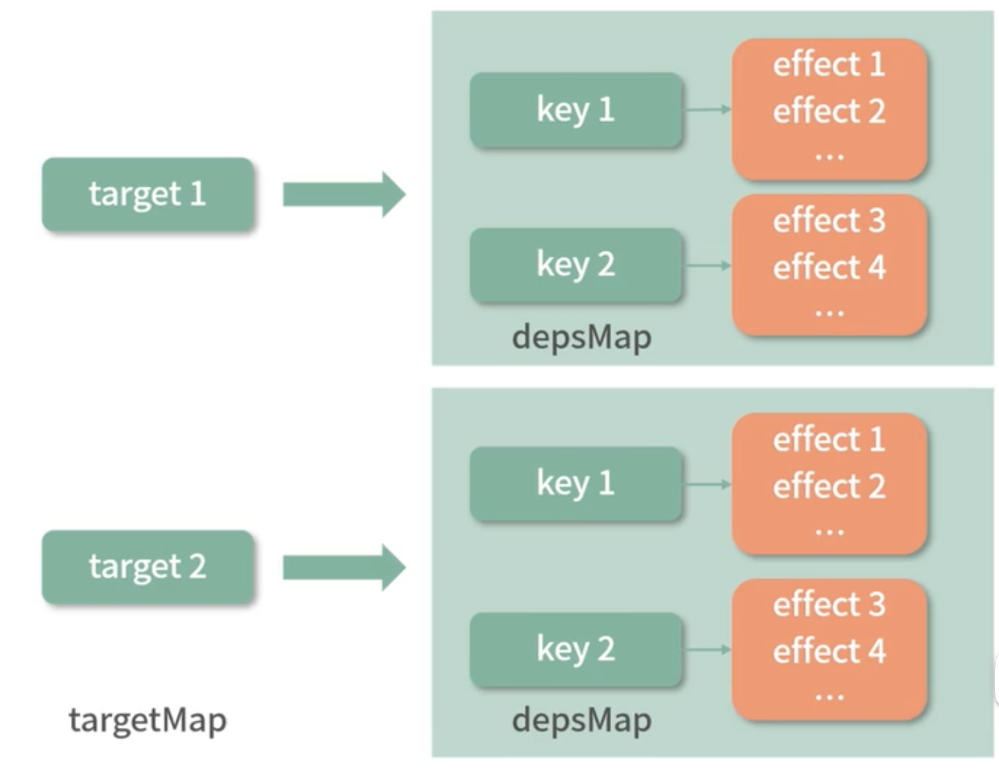

# vue3的优化
- 源码优化
  - 对vue开发本身的优化
  - 使用monorepo和ts管理和开发源码，提升源码可维护性
- 性能优化
  - 移除冷门feature
  - 引入 tree-shaking
    - 依赖ES Module
- 数据劫持优化
  - 使用 Proxy API
- 编译优化
  - 在编译阶段优化编译结果，实现运行时 patch 过程的优化
    - 通过编译阶段对静态模版的分析，编译生成了 block tree
    - block tree
      - 是一个将模版基于动态节点指令切割的嵌套区块，每个区块内的节点结构是固定的，每个区块只需要以一个Array 来追踪自身包含的动态节点
      - 借助 block tree，vue 将 vnode 更新性能由与模版整体大小相关提升为与动态内容的数量相关
  - 对 slot 编译优化、事件监听函数的缓存优化，并在运行时重写了 diff 算法
- 语法优化
  - composition API


# 组建渲染：组件到真实 DOM 是如何转变的
组件：是一个抽象概念，是对一个 DOM 树的抽象

一个组件想要渲染成 DOM 需要的步骤：
创建 vnode  ->  渲染 vnode   ->  生成DOM

## 应用程序初始化



```js
import {createApp} from 'vue'
import App from './App'

const app = createApp(App)
app.mount('#app')
```

`createApp`的内部实现：
```js
const createApp = (...args) => {
  // 创建 app 对象
  const app = ensureRenderer().createApp(...args)
  const {mount} = app
  // 重写 mount 方法
  app.mount = (contionerOrSelector) => {
    // ...
  }

  return app
}
```
`ensureRenderer`创建一个渲染器对象

- 在整个 app 对象的创建过程中，vue 利用闭包和函数柯里化的技巧，很好的实现了参数保留
- 比如，在执行 app.mount 的时候，不需要传入渲染器 render，因为在执行 createRenderAPI 的时候渲染器 render 参数已经被保留下来


为什么要重写 mount 方法？因为 vue 不仅是 web 平台，他的目标是可以跨平台渲染，createApp 内部的 app.mount 是一个标准的可跨平台的组建渲染流程
mount 重写：
```js
  const { mount } = app
  app.mount = (containerOrSelector: Element | ShadowRoot | string): any => {
    // 标准化容器
    const container = normalizeContainer(containerOrSelector)
    if (!container) return

    const component = app._component

    // 如果组件没有 render 或 template，就使用容器的 innerHTML 作为模版
    if (!isFunction(component) && !component.render && !component.template) {
      component.template = container.innerHTML
      if (__COMPAT__ && __DEV__) {
    }

    // 在挂载前清空内容
    container.innerHTML = ''

    // 挂载
    const proxy = mount(container, false, container instanceof SVGElement)
    if (container instanceof Element) {
      container.removeAttribute('v-cloak')
      container.setAttribute('data-v-app', '')
    }
    return proxy
  }
```
这段代码在`runtime-dom`，因为这种挂载是 web 相关的


## 核心渲染流程：创建 vnode 和渲染 vnode


vnode的本质是使用 js对象来描述 DOM

创建 vnode 的方法在`runtime-core/vnode`
渲染创建好的 vnode 就是 render 函数，在`runtime-core/renderer`
render 函数会调用 patch 函数
patch 函数接收多个参数：
- n1：表示旧的 vnode，当为 null 时表示第一次挂载
- n2：新的 vnode
- container：表示DOM容器，在 vnode 渲染成 DOM 后，会挂载到 container

对于不同类型的 vnode，patch 函数会进行不同的处理：
- 组件
  - 会进入`processComponent`
    - 挂载组件`mountComponent`
      - 创建组件实例`createComponentInstance`
        - 内部通过对象方式创建了当前渲染组件的实例
      - 设置组件实例`setupComponent`
        - instance 保留了组件的相关数据，维护组件的上下文，包括 props、插槽，以及其他实例的属性的初始化设置
      - 设置并运行带副作用的的渲染函数`setupRenderEffect`
        - 创建响应式的副作用渲染函数
          - 渲染组件生成子树 vnode
          - 在初始渲染时只做两件事情：
            - 生成组件 subTree
            - 把 subTree 挂载到 container 中
    - 更新组件`updateCompinent`
- 普通 DOM 元素
  - 进入`processElement`
    - 创建 DOM 元素节点`hostCreateElement`
    - 处理 props `hostPatchProp`
    - 处理 children `mountChildren`
    - 挂载到 container 上 `hostInsert`


# 组件更新流程
组件渲染过程中创建了一个带副作用的 render 函数，当数据变化的时候就会执行这个函数触发组件更新

副作用渲染函数是`setupRenderEffect`

```js
if (next) {
  next.el = vnode.el
// 在更新时会先判断是有有新的组件 vnode，如果有，执行`updateComponentPreRender`更新组件 vnode 节点信息
  updateComponentPreRender(instance, next, optimized)
} else {
  // 没有则使用之前的组件 vnode
  next = vnode
}

// beforeUpdate hook
if (bu) {
  invokeArrayFns(bu)
}
// onVnodeBeforeUpdate
if ((vnodeHook = next.props && next.props.onVnodeBeforeUpdate)) {
  invokeVNodeHook(vnodeHook, parent, next, vnode)
}
if (
  __COMPAT__ &&
  isCompatEnabled(DeprecationTypes.INSTANCE_EVENT_HOOKS, instance)
) {
  instance.emit('hook:beforeUpdate')
}
toggleRecurse(instance, true)


// 然后渲染新的子树 vnode `renderComponentRoot`
const nextTree = renderComponentRoot(instance)
// 缓存旧的 子树 vnode
const prevTree = instance.subTree
// 更新子树 vnode
instance.subTree = nextTree

// 组件更新核心逻辑
patch(
  prevTree,
  nextTree,
  // parent may have changed if it's in a teleport
  hostParentNode(prevTree.el!)!,
  // anchor may have changed if it's in a fragment
  getNextHostNode(prevTree),
  instance,
  parentSuspense,
  isSVG
)

// 缓存更新后的DOM
next.el = nextTree.el
```

接下来看 patch 的实现
```js
// 新旧 vnode 相同没有变化 直接退出
if (n1 === n2) {
  return
}

// 如果存在新旧节点且类型不同，则销毁旧节点
if (n1 && !isSameVNodeType(n1, n2)) {
  anchor = getNextHostNode(n1)
  unmount(n1, parentComponent, parentSuspense, true)
  // n1 设置为 null，保证之后都走 mount 的逻辑
  n1 = null
}

if (n2.patchFlag === PatchFlags.BAIL) {
  optimized = false
  n2.dynamicChildren = null
}


const { type, ref, shapeFlag } = n2
// 根据不同类型执行不同逻辑
switch(type) {
  // ...
}
```

看看组件的更新，执行`updateComponent`
```js
const instance = (n2.component = n1.component)!
// 根据新旧 vnode 判断是否需要更新
if (shouldUpdateComponent(n1, n2, optimized)) {
  if (
    __FEATURE_SUSPENSE__ &&
    instance.asyncDep &&
    !instance.asyncResolved
  ) {
    updateComponentPreRender(instance, n2, optimized)
    return
  } else {
    // normal update
    instance.next = n2
    // 子组件也可能被添加到队列里，移除他们，防止对一个组件的重复更新
    invalidateJob(instance.update)
    // 执行子组件的副作用渲染函数
    instance.update()
  }
} else {
  // 不需要更新，只复制属性
  n2.component = n1.component
  n2.el = n1.el
  instance.vnode = n2
}
```

组件更新代码，在`updateComponentPreRender`
```js
// 新的 vnode 的 component 指向
nextVNode.component = instance
// 旧的 vnode 的 props
const prevProps = instance.vnode.props
// 组件实例的 vnode 更新
instance.vnode = nextVNode
// 清空 next
instance.next = null
// 更新 props
updateProps(instance, nextVNode.props, prevProps, optimized)
// 更新 slots
updateSlots(instance, nextVNode.children, optimized)

pauseTracking()
// props update may have triggered pre-flush watchers.
// flush them before the render update.
flushPreFlushCbs(undefined, instance.update)
resetTracking()
```


## diff 过程
主要涉及到`patchChildren`函数
其中又执行了`patchKeyedChildren`等函数

diff 又分为多种策略：
1. 从头部同步
   1. 维护头部索引 i 和，新旧节点长度
   2. 当取出的新旧节点相同时，调用`patch`方法更新节点
   3. 当新旧节点不同时，退出循环
2. 从尾部同步
   1. 与头部相同
3. 接下来有3种情况要处理
   1. 新节点有剩余需要添加新节点
      1. `i>e1 && i<=e2`，那么i 到 e2 之间的节点都进行插入
   2. 旧节点有剩余需要删除旧节点
      1. `i>e2 && i<=e1`，那么 i 到 e1 之间的所有节点都删除
   3. 未知子序列
      1. 当两个节点类型相同时，执行更新操作
      2. 当新子节点没有旧子节点中某些节点时，执行删除
      3. 当新子节点多出某些节点时，执行添加
      4. 这些操作中最麻烦的就是移动
      5. 具体步骤
         1. 简历索引图
            1. 对于新旧子序列中的节点，key相同的就是同一个节点，执行 patch 即可
            2. 遍历新子序列，将 key 与 index 存储到 map 中
         2. 更新和移除旧节点
            1. 遍历旧子序列，根据之前创建的 map，查找旧子序列中的节点在新子序列中的索引
            2. 如果找不到，则说明新子序列中没有该节点，则删除它
            3. 如果找到了，则将它在旧子序列中的索引更新到`newIndexToOldIndexMap`（这里的索引加1偏移）
            4. `maxNewIndexSoFar`始终存储的是上次求值的的`newIndex`
            5. 当`newIndex<maxNewIndexSoFar`说明顺序遍历旧子序列的节点在新子序列的索引并不是一直递增的，也就是存在移动的情况
            6. 更新新旧子序列中匹配的节点
            7. 当新子序列中所有节点都已更新而旧子序列仍未遍历完，说明旧子序列中剩余节点是多余的，删除
            8. 到此，新旧子序列中的节点更新和多余旧节点删除都已完成
            9. 建立了一个`newIndexToOldIndexMap`存储新子序列节点的索引与旧子序列节点索引的关系，并确定了是否有移动
         3.  移动和挂载新节点
             1. 计算最长递增子序列
             2. 倒序遍历新子序列
             3. 判断要新增的节点则新增
             4. 需要移动的节点则移动


# 组件化
## setup：组件渲染前的初始化过程
vue3的组件在编写时可以添加一个 setup 启动函数，是 composition API 逻辑组织的入口

### 创建和设置组件实例
这个过程发生在`mountComponent`
该函数会先创建组件实例，然后设置实例，最后调用副作用渲染函数
首先看创建组件实例，通过`createComponentInstance`方法创建，返回一个组件对象，定义在`runtime-core/component`
接下来看`setupComponent`
```js
export function setupComponent(
  instance: ComponentInternalInstance,
  isSSR = false
) {
  isInSSRComponentSetup = isSSR

  const { props, children } = instance.vnode
  // 判断是否是一个有状态组件
  const isStateful = isStatefulComponent(instance)
  // 初始化 props
  initProps(instance, props, isStateful, isSSR)
  // 初始化 slots
  initSlots(instance, children)

  // 设置有状态组件实例
  const setupResult = isStateful
    ? setupStatefulComponent(instance, isSSR)
    : undefined
  isInSSRComponentSetup = false
  return setupResult
}
```

`setupStatefulComponent`主要做了如下事情：
- 创建渲染代理的属性访问缓存
- 创建渲染上下文代理
  - vue3 为了方便维护，把组件中不同状态的数据存储到不同的属性中，比如`setupState ctx data props`
  - 执行组件渲染时，直接访问渲染上下文 `instance.ctx`中的属性，做一层代理，对渲染上下文的属性进行访问和修改代理到`setupState ctx data props`
- 判断处理 setup 函数
  - 如果 setup 函数需要参数，则创建一个 setupContext
    setupContext 创建的对象对应 setup 的第二个参数
    ```js
    export function createSetupContext(
      instance: ComponentInternalInstance
    ): SetupContext {
      const expose: SetupContext['expose'] = exposed => {
        instance.exposed = exposed || {}
      }
      let attrs: Data  
      return {
        get attrs() {
          return attrs || (attrs = createAttrsProxy(instance))
        },
        slots: instance.slots,
        emit: instance.emit,
        expose
      }
    }
    ```
  - 执行 setup 并获取结果 通过`callWithErrorHandling`函数
    ```js
    const setupResult = callWithErrorHandling(
      setup,
      instance,
      ErrorCodes.SETUP_FUNCTION,
      [__DEV__ ? shallowReadonly(instance.props) : instance.props, setupContext]
    )

    export function callWithErrorHandling(
      fn: Function,
      instance: ComponentInternalInstance | null,
      type: ErrorTypes,
      args?: unknown[]
    ) {
      let res
      try {
        res = args ? fn(...args) : fn()
      } catch (err) {
        handleError(err, instance, type)
      }
      return res
    }
    ```
  - 处理 setup 结果  `handleSetupResult(instance, setupResult, isSSR)`
    ```js
    export function handleSetupResult(
      instance: ComponentInternalInstance,
      setupResult: unknown,
      isSSR: boolean
    ) {
      if (isFunction(setupResult)) {
        // setup 返回渲染函数
        instance.render = setupResult as InternalRenderFunction
      } else if (isObject(setupResult)) {
        // 返回结果变成响应式
        instance.setupState = proxyRefs(setupResult)
      }
      // 完成组件实例的设置
      finishComponentSetup(instance, isSSR)
    }
    ```
    - `finishComponentSetup`函数的实现
      ```js
      export function finishComponentSetup(
        instance: ComponentInternalInstance,
        isSSR: boolean,
        skipOptions?: boolean
      ) {
        const Component = instance.type as ComponentOptions
        // 对模版或render 函数的标准化
        if (!instance.render) {

          if (!isSSR && compile && !Component.render) {
            const template =
              (__COMPAT__ &&
                instance.vnode.props &&
                instance.vnode.props['inline-template']) ||
              Component.template
            if (template) {
              const { isCustomElement, compilerOptions } = instance.appContext.config
              const { delimiters, compilerOptions: componentCompilerOptions } = Component
              const finalCompilerOptions: CompilerOptions = extend(
                extend(
                  {
                    isCustomElement,
                    delimiters
                  },
                  compilerOptions
                ),
                componentCompilerOptions
              )
              Component.render = compile(template, finalCompilerOptions)
            }
          }
          // 运行时编译
          instance.render = (Component.render || NOOP) as InternalRenderFunction

          // 对于使用 with 的运行时编译渲染函数，使用新的渲染上下文代理
          if (installWithProxy) {
            installWithProxy(instance)
          }
        }

        // 兼容 2.x options 
        if (__FEATURE_OPTIONS_API__ && !(__COMPAT__ && skipOptions)) {
          setCurrentInstance(instance)
          pauseTracking()
          applyOptions(instance)
          resetTracking()
          unsetCurrentInstance()
        }
      }
      ```


# 响应式原理
除了组件化，VUE 的另一个核心设计就是响应式，本质是数据变化后自动执行某些函数
映射到组件的实现就是，当数据变化后，会自动触发组件的重新渲染

vue3 使用 Proxy API 重写了响应式API，并独立维护 reactivity 库

## reactive 函数
`reactive`函数的实现
```js
export function reactive(target: object) {
  // if trying to observe a readonly proxy, return the readonly version.
  if (target && (target as Target)[ReactiveFlags.IS_READONLY]) {
    return target
  }
  return createReactiveObject(
    target,
    false,
    mutableHandlers,
    mutableCollectionHandlers,
    reactiveMap
  )
}
```

`createReactiveObject`
```js
function createReactiveObject(
  target: Target,
  isReadonly: boolean,
  baseHandlers: ProxyHandler<any>,
  collectionHandlers: ProxyHandler<any>,
  proxyMap: WeakMap<Target, any>
) {
  if (!isObject(target)) {
    return target
  }
  // target is already a Proxy, return it.
  // exception: calling readonly() on a reactive object
  if (
    target[ReactiveFlags.RAW] &&
    !(isReadonly && target[ReactiveFlags.IS_REACTIVE])
  ) {
    return target
  }
  // target already has corresponding Proxy
  const existingProxy = proxyMap.get(target)
  if (existingProxy) {
    return existingProxy
  }
  // only a whitelist of value types can be observed.
  const targetType = getTargetType(target)
  if (targetType === TargetType.INVALID) {
    return target
  }
  const proxy = new Proxy(
    target,
    targetType === TargetType.COLLECTION ? collectionHandlers : baseHandlers
  )
  proxyMap.set(target, proxy)
  return proxy
}
```

接下来看 Proxy 处理器对象 `mutableHandlers` 的实现
```js
export const mutableHandlers: ProxyHandler<object> = {
  // 访问对象属性触发
  get,
  // 设置对象属性触发
  set,
  // 删除对象属性触发
  deleteProperty,
  // in 操作触发
  has,
  // Object.getOwnPropertyNames 触发
  ownKeys
}
```

### 依赖收集相关的 get
```js
function createGetter(isReadonly = false, shallow = false) {
  return function get(target: Target, key: string | symbol, receiver: object) {
    if (key === ReactiveFlags.IS_REACTIVE) {
      return !isReadonly
    } else if (key === ReactiveFlags.IS_READONLY) {
      return isReadonly
    } else if (
      key === ReactiveFlags.RAW &&
      receiver ===
        (isReadonly
          ? shallow
            ? shallowReadonlyMap
            : readonlyMap
          : shallow
          ? shallowReactiveMap
          : reactiveMap
        ).get(target)
    ) {
      return target
    }

    const targetIsArray = isArray(target)

    if (!isReadonly && targetIsArray && hasOwn(arrayInstrumentations, key)) {
      return Reflect.get(arrayInstrumentations, key, receiver)
    }

    const res = Reflect.get(target, key, receiver)

    if (isSymbol(key) ? builtInSymbols.has(key) : isNonTrackableKeys(key)) {
      return res
    }

    if (!isReadonly) {
      track(target, TrackOpTypes.GET, key)
    }

    if (shallow) {
      return res
    }

    if (isRef(res)) {
      // ref unwrapping - does not apply for Array + integer key.
      const shouldUnwrap = !targetIsArray || !isIntegerKey(key)
      return shouldUnwrap ? res.value : res
    }

    if (isObject(res)) {
      // Convert returned value into a proxy as well. we do the isObject check
      // here to avoid invalid value warning. Also need to lazy access readonly
      // and reactive here to avoid circular dependency.
      return isReadonly ? readonly(res) : reactive(res)
    }

    return res
  }
}
```

在获取 key 值的时候，通过`Reflect.get`获取
如果 target 是数组且 key 命中了 `arrayInstrumentations`，则执行对应函数，看看`arrayInstrumentations`的定义
```js
function createArrayInstrumentations() {
  const instrumentations: Record<string, Function> = {}
  // instrument identity-sensitive Array methods to account for possible reactive
  // values
  ;(['includes', 'indexOf', 'lastIndexOf'] as const).forEach(key => {
    instrumentations[key] = function (this: unknown[], ...args: unknown[]) {
      // 获取原始数组
      const arr = toRaw(this) as any
      for (let i = 0, l = this.length; i < l; i++) {
        // 依赖收集
        track(arr, TrackOpTypes.GET, i + '')
      }
      // we run the method using the original args first (which may be reactive)
      // 先尝试使用参数本身，可能是响应式数据
      const res = arr[key](...args)
      if (res === -1 || res === false) {
        // if that didn't work, run it again using raw values.
        return arr[key](...args.map(toRaw))
      } else {
        return res
      }
    }
  })
  // instrument length-altering mutation methods to avoid length being tracked
  // which leads to infinite loops in some cases (#2137)
  ;(['push', 'pop', 'shift', 'unshift', 'splice'] as const).forEach(key => {
    instrumentations[key] = function (this: unknown[], ...args: unknown[]) {
      pauseTracking()
      const res = (toRaw(this) as any)[key].apply(this, args)
      resetTracking()
      return res
    }
  })
  return instrumentations
}
```

`track`函数进行依赖收集
```js
// 是否收集依赖
let shouldTrack = true
// 当前激活的 effect
let activeEffect: ReactiveEffect | undefined
// 原始数据对象 map
const targetMap = new WeakMap<any, KeyToDepMap>()


export function track(target: object, type: TrackOpTypes, key: unknown) {
  if (!isTracking()) {
    return
  }
  let depsMap = targetMap.get(target)
  if (!depsMap) {
    // 每个 target 对应一个 depsMap
    targetMap.set(target, (depsMap = new Map()))
  }
  let dep = depsMap.get(key)
  if (!dep) {
    // 每个 key 对应一个 dep
    depsMap.set(key, (dep = createDep()))
  }

  const eventInfo = __DEV__
    ? { effect: activeEffect, target, type, key }
    : undefined

  trackEffects(dep, eventInfo)
}

export function trackEffects(
  dep: Dep,
  debuggerEventExtraInfo?: DebuggerEventExtraInfo
) {
  let shouldTrack = false
  if (effectTrackDepth <= maxMarkerBits) {
    if (!newTracked(dep)) {
      dep.n |= trackOpBit // set newly tracked
      shouldTrack = !wasTracked(dep)
    }
  } else {
    // Full cleanup mode.
    shouldTrack = !dep.has(activeEffect!)
  }

  if (shouldTrack) {
    // 收集当前激活的 effect 作为依赖
    dep.add(activeEffect!)
    // 当前激活的 effect 收集 dep 集合作为依赖
    activeEffect!.deps.push(dep)
  }
}
```



### 派发通知
在更改响应式对象的值时，会触发`set`，此时还会触发更新
```js
function createSetter(shallow = false) {
  return function set(
    target: object,
    key: string | symbol,
    value: unknown,
    receiver: object
  ): boolean {
    let oldValue = (target as any)[key]
    if (!shallow && !isReadonly(value)) {
      value = toRaw(value)
      oldValue = toRaw(oldValue)
      if (!isArray(target) && isRef(oldValue) && !isRef(value)) {
        oldValue.value = value
        return true
      }
    } else {
      // in shallow mode, objects are set as-is regardless of reactive or not
    }

    const hadKey =
      isArray(target) && isIntegerKey(key)
        ? Number(key) < target.length
        : hasOwn(target, key)
    const result = Reflect.set(target, key, value, receiver)
    // don't trigger if target is something up in the prototype chain of original
    if (target === toRaw(receiver)) {
      if (!hadKey) {
        trigger(target, TriggerOpTypes.ADD, key, value)
      } else if (hasChanged(value, oldValue)) {
        trigger(target, TriggerOpTypes.SET, key, value, oldValue)
      }
    }
    return result
  }
}
```

`set`函数会调用`trigger`
```js
export function triggerEffects(
  dep: Dep | ReactiveEffect[],
  debuggerEventExtraInfo?: DebuggerEventExtraInfo
) {
  // spread into array for stabilization
  for (const effect of isArray(dep) ? dep : [...dep]) {
    if (effect !== activeEffect || effect.allowRecurse) {
      if (__DEV__ && effect.onTrigger) {
        effect.onTrigger(extend({ effect }, debuggerEventExtraInfo))
      }
      if (effect.scheduler) {
        effect.scheduler()
      } else {
        effect.run()
      }
    }
  }
}
```


## 计算属性
vue3 提供了 `computed`来定义计算属性
```js
export function computed<T>(
  getterOrOptions: ComputedGetter<T> | WritableComputedOptions<T>,
  debugOptions?: DebuggerOptions
) {
  let getter: ComputedGetter<T>
  let setter: ComputedSetter<T>

  const onlyGetter = isFunction(getterOrOptions)
  if (onlyGetter) {
    getter = getterOrOptions
    setter = NOOP
  } else {
    getter = getterOrOptions.get
    setter = getterOrOptions.set
  }

  const cRef = new ComputedRefImpl(getter, setter, onlyGetter || !setter)

  return cRef as any
}

class ComputedRefImpl<T> {
  public dep?: Dep = undefined

  private _value!: T
  private _dirty = true
  public readonly effect: ReactiveEffect<T>

  public readonly __v_isRef = true
  public readonly [ReactiveFlags.IS_READONLY]: boolean

  constructor(
    getter: ComputedGetter<T>,
    private readonly _setter: ComputedSetter<T>,
    isReadonly: boolean
  ) {
    this.effect = new ReactiveEffect(getter, () => {
      if (!this._dirty) {
        this._dirty = true
        triggerRefValue(this)
      }
    })
    this[ReactiveFlags.IS_READONLY] = isReadonly
  }

  get value() {
    // the computed ref may get wrapped by other proxies e.g. readonly() #3376
    const self = toRaw(this)
    trackRefValue(self)
    if (self._dirty) {
      self._dirty = false
      self._value = self.effect.run()!
    }
    return self._value
  }

  set value(newValue: T) {
    this._setter(newValue)
  }
}
```

## 监听属性
vue3 提供`watch`函数创建监听器
watch 又调用了 doWatch，doWatch 的定义很长，下面是其主要步骤：
1. 标准化 source
   1. 如果 source 是 ref 对象，则创建一个 `source.value` 的 getter 函数
   2. 如果 source 是 reactive 对象，则创建一个访问 source 的 getter 函数，并设置 deep 为 true
   3. 如果 source 是一个函数，则会判断 cb 是否存在
2. 构造 applyCb 函数
   1. cb 函数有三个参数：`newValue  oldValue  onInvalidate`
   2. 首先获取 newValue，第一次执行时，oldValue 为 undefined
   3. 判断新旧值是否相同
3. 创建 schedular 时序执行函数
   1. 创建 ReactiveEffect 对象，收集依赖
   2. 其回调受监听属性的更新策略影响
      1. sync：同步模式，数据变化时同步执行 watcher
      2. pre：在组件更新之前执行，如果组件还没挂载则会同步执行
      3. post：在组件更新之后执行
4. 创建 effect 副作用函数
5. 返回监听器销毁函数

当 deep 为 true 时，通过`traverse`函数包装 getter，traverse 会递归的访问 value 的每个子属性


# 组件生命周期
在 vue3 中，提供了一些 API 来设置生命周期回调

注册钩子函数：
```js
export const onBeforeMount = createHook(LifecycleHooks.BEFORE_MOUNT)
export const onMounted = createHook(LifecycleHooks.MOUNTED)
export const onBeforeUpdate = createHook(LifecycleHooks.BEFORE_UPDATE)
export const onUpdated = createHook(LifecycleHooks.UPDATED)
export const onBeforeUnmount = createHook(LifecycleHooks.BEFORE_UNMOUNT)
export const onUnmounted = createHook(LifecycleHooks.UNMOUNTED)
export const onServerPrefetch = createHook(LifecycleHooks.SERVER_PREFETCH)

export type DebuggerHook = (e: DebuggerEvent) => void
export const onRenderTriggered = createHook<DebuggerHook>(
  LifecycleHooks.RENDER_TRIGGERED
)
export const onRenderTracked = createHook<DebuggerHook>(
  LifecycleHooks.RENDER_TRACKED
)
```

生命周期钩子函数基本都是通过`createHook`函数创建的
```js
export const createHook =
  <T extends Function = () => any>(lifecycle: LifecycleHooks) =>
  (hook: T, target: ComponentInternalInstance | null = currentInstance) =>
    // post-create lifecycle registrations are noops during SSR (except for serverPrefetch)
    (!isInSSRComponentSetup || lifecycle === LifecycleHooks.SERVER_PREFETCH) &&
    injectHook(lifecycle, hook, target)
```
`createHook`通过`injectHook`注册钩子函数
```js
export function injectHook(
  type: LifecycleHooks,
  hook: Function & { __weh?: Function },
  target: ComponentInternalInstance | null = currentInstance,
  prepend: boolean = false
): Function | undefined {
  if (target) {
    const hooks = target[type] || (target[type] = [])
    // 封装 hook 钩子函数并缓存
    const wrappedHook =
      hook.__weh ||
      (hook.__weh = (...args: unknown[]) => {
        if (target.isUnmounted) {
          return
        }
        // 停止依赖收集
        pauseTracking()
        // 设置 target 为当前运行的组件实例
        setCurrentInstance(target)
        // 执行钩子函数
        const res = callWithAsyncErrorHandling(hook, target, type, args)
        unsetCurrentInstance()
        resetTracking()
        return res
      })
    if (prepend) {
      hooks.unshift(wrappedHook)
    } else {
      hooks.push(wrappedHook)
    }
    return wrappedHook
  } 
}
```

## onBeforeMount & onMounted
`onBeforeMount`钩子会在组件挂载前执行
`onMounted`钩子会在组件挂载后执行

在`setupRenderEffect`函数中，设置了组件挂载的处理
```js
const { bm, m, parent } = instance
// beforeMount hook
if (bm) {
  invokeArrayFns(bm)
}

patch()

// mounted hook
if (m) {
  queuePostRenderEffect(m, parentSuspense)
}
```

对于嵌套组件：p-beforeMount -> c-beforeMount -> c-mounted -> p-mounted

## onBeforeUpdate & onUpdate
在`setupRenderEffect`函数中，设置了组件更新的处理
```js
let { next, bu, u, parent, vnode } = instance
// beforeUpdate hook
if (bu) {
  invokeArrayFns(bu)
}
patch()
// updated hook
if (u) {
  queuePostRenderEffect(u, parentSuspense)
}
```

## onBeforeUnmount & onUnmounted
在`unmountComponent`函数中，定义了卸载处理
```js
const { bum, scope, update, subTree, um } = instance
// beforeUnmount hook
if (bum) {
  invokeArrayFns(bum)
}

// unmounted hook
if (um) {
  queuePostRenderEffect(um, parentSuspense)
}
```

对于嵌套组件：p-beforeUnmount -> c-beforeUnmount -> c-unmounted -> p-unmounted

## onErrorCaptured
在`handleError`函数中定义了该钩子的处理
```js
while (cur) {
  const errorCapturedHooks = cur.ec
  if (errorCapturedHooks) {
    for (let i = 0; i < errorCapturedHooks.length; i++) {
      if (
        errorCapturedHooks[i](err, exposedInstance, errorInfo) === false
      ) {
        return
      }
    }
  }
  cur = cur.parent
}
```

## onRenderTracked & onRenderTriggered
在`setupRenderEffect`函数中处理这两个钩子
```js
if (__DEV__) {
  effect.onTrack = instance.rtc
    ? e => invokeArrayFns(instance.rtc!, e)
    : void 0
  effect.onTrigger = instance.rtg
    ? e => invokeArrayFns(instance.rtg!, e)
    : void 0
  // @ts-ignore (for scheduler)
  update.ownerInstance = instance
}
```

当访问响应式对象时，会进行依赖收集，同时处理收集钩子函数
```js
if (__DEV__ && activeEffect!.onTrack) {
  activeEffect!.onTrack(
    Object.assign(
      {
        effect: activeEffect!
      },
      debuggerEventExtraInfo
    )
  )
}
```

trigger 相同
```js
if (__DEV__ && effect.onTrigger) {
  effect.onTrigger(extend({ effect }, debuggerEventExtraInfo))
}
```


# 依赖注入：子孙组件共享数据
跨父子组件通信，vue2 中提供了`provide`，vue3 中也有这个 API

`provide`的实现
```js

export function provide<T>(key: InjectionKey<T> | string | number, value: T) {
  if (!currentInstance) {
    if (__DEV__) {
      warn(`provide() can only be used inside setup().`)
    }
  } else {
    let provides = currentInstance.provides
    // by default an instance inherits its parent's provides object
    // but when it needs to provide values of its own, it creates its
    // own provides object using parent provides object as prototype.
    // this way in `inject` we can simply look up injections from direct
    // parent and let the prototype chain do the work.
    const parentProvides =
      currentInstance.parent && currentInstance.parent.provides
    if (parentProvides === provides) {
      provides = currentInstance.provides = Object.create(parentProvides)
    }
    // TS doesn't allow symbol as index type
    provides[key as string] = value
  }
}
```

`inject`的实现
```js
export function inject(
  key: InjectionKey<any> | string,
  defaultValue?: unknown,
  treatDefaultAsFactory = false
) {
  // fallback to `currentRenderingInstance` so that this can be called in
  // a functional component
  const instance = currentInstance || currentRenderingInstance
  if (instance) {
    // #2400
    // to support `app.use` plugins,
    // fallback to appContext's `provides` if the intance is at root
    const provides =
      instance.parent == null
        ? instance.vnode.appContext && instance.vnode.appContext.provides
        : instance.parent.provides

    if (provides && (key as string | symbol) in provides) {
      // TS doesn't allow symbol as index type
      return provides[key as string]
    } else if (arguments.length > 1) {
      return treatDefaultAsFactory && isFunction(defaultValue)
        ? defaultValue.call(instance.proxy)
        : defaultValue
    } else if (__DEV__) {
      warn(`injection "${String(key)}" not found.`)
    }
  } else if (__DEV__) {
    warn(`inject() can only be used inside setup() or functional components.`)
  }
}
```


# 模版编译
vue 的模版编译分为 ssr 和 web
web 编译的入口是`compile`函数，定义在`compiler-dom`包
```js
export function compile(
  template: string,
  options: CompilerOptions = {}
): CodegenResult {
  return baseCompile(
    template,
    extend({}, parserOptions, options, {
      nodeTransforms: [
        // ignore <script> and <tag>
        // this is not put inside DOMNodeTransforms because that list is used
        // by compiler-ssr to generate vnode fallback branches
        ignoreSideEffectTags,
        ...DOMNodeTransforms,
        ...(options.nodeTransforms || [])
      ],
      directiveTransforms: extend(
        {},
        DOMDirectiveTransforms,
        options.directiveTransforms || {}
      ),
      transformHoist: __BROWSER__ ? null : stringifyStatic
    })
  )
}
```

通过`baseCompile`函数实现
```js
export function baseCompile(
  template: string | RootNode,
  options: CompilerOptions = {}
): CodegenResult {
  const onError = options.onError || defaultOnError
  const isModuleMode = options.mode === 'module'
  /* istanbul ignore if */
  if (__BROWSER__) {
    if (options.prefixIdentifiers === true) {
      onError(createCompilerError(ErrorCodes.X_PREFIX_ID_NOT_SUPPORTED))
    } else if (isModuleMode) {
      onError(createCompilerError(ErrorCodes.X_MODULE_MODE_NOT_SUPPORTED))
    }
  }

  const prefixIdentifiers =
    !__BROWSER__ && (options.prefixIdentifiers === true || isModuleMode)
  if (!prefixIdentifiers && options.cacheHandlers) {
    onError(createCompilerError(ErrorCodes.X_CACHE_HANDLER_NOT_SUPPORTED))
  }
  if (options.scopeId && !isModuleMode) {
    onError(createCompilerError(ErrorCodes.X_SCOPE_ID_NOT_SUPPORTED))
  }

  // 解析 template 生成 AST
  const ast = isString(template) ? baseParse(template, options) : template
  const [nodeTransforms, directiveTransforms] =
    getBaseTransformPreset(prefixIdentifiers)

  if (!__BROWSER__ && options.isTS) {
    const { expressionPlugins } = options
    if (!expressionPlugins || !expressionPlugins.includes('typescript')) {
      options.expressionPlugins = [...(expressionPlugins || []), 'typescript']
    }
  }

  // AST 转换
  transform(
    ast,
    extend({}, options, {
      prefixIdentifiers,
      nodeTransforms: [
        ...nodeTransforms,
        ...(options.nodeTransforms || []) // user transforms
      ],
      directiveTransforms: extend(
        {},
        directiveTransforms,
        options.directiveTransforms || {} // user transforms
      )
    })
  )

  // 生成代码
  return generate(
    ast,
    extend({}, options, {
      prefixIdentifiers
    })
  )
}
```

## AST 生成

看看`baseParse`的定义：
```js
export function baseParse(
  content: string,
  options: ParserOptions = {}
): RootNode {
  // 创建解析上下文
  const context = createParserContext(content, options)
  const start = getCursor(context)
  // 解析子节点，并创建AST
  return createRoot(
    parseChildren(context, TextModes.DATA, []),
    getSelection(context, start)
  )
}
```

创建解析上下文的过程：
```js
function createParserContext(
  content: string,
  rawOptions: ParserOptions
): ParserContext {
  const options = extend({}, defaultParserOptions)

  let key: keyof ParserOptions
  for (key in rawOptions) {
    // @ts-ignore
    options[key] =
      rawOptions[key] === undefined
        ? defaultParserOptions[key]
        : rawOptions[key]
  }
  return {
    options,
    column: 1,
    line: 1,
    offset: 0,
    originalSource: content,
    source: content,
    inPre: false,
    inVPre: false,
    onWarn: options.onWarn
  }
}
```

`parseChildren`的实现：
该函数代码较多，主体流程是：自顶向下遍历代码，根据不同情况解析代码，把生成的 node 添加到 AST nodes 数组中；在解析过程中，解析上下文状态同步变化
其分支主要包括注释、插值、普通文本、元素节点的解析
注释节点：
```js
if (startsWith(s, '<!--')) {
  node = parseComment(context)
}
```

插值解析：
```js
if (!context.inVPre && startsWith(s, context.options.delimiters[0])) {
  // '{{'
  node = parseInterpolation(context, mode)
}
```

普通文本：
```js
if (!node) {
  node = parseText(context, mode)
}
```

元素解析：
```js
node = parseElement(context, ancestors)
```

## AST 转换
首先通过`getBaseTransformPreset`函数获得节点和指令的转换方法
```js
export function getBaseTransformPreset(
  prefixIdentifiers?: boolean
): TransformPreset {
  return [
    [
      transformOnce,
      transformIf,
      transformMemo,
      transformFor,
      ...(__COMPAT__ ? [transformFilter] : []),
      ...(!__BROWSER__ && prefixIdentifiers
        ? [
            // order is important
            trackVForSlotScopes,
            transformExpression
          ]
        : __BROWSER__ && __DEV__
        ? [transformExpression]
        : []),
      transformSlotOutlet,
      transformElement,
      trackSlotScopes,
      transformText
    ],
    {
      on: transformOn,
      bind: transformBind,
      model: transformModel
    }
  ]
}
```
然后将转换方法作为配置传入`transform`
`transform`的实现：
```js
export function transform(root: RootNode, options: TransformOptions) {
  // 创建 transform 上下文
  const context = createTransformContext(root, options)
  // 遍历 AST 节点
  traverseNode(root, context)
  if (options.hoistStatic) {
    // 静态提升
    hoistStatic(root, context)
  }
  if (!options.ssr) {
    createRootCodegen(root, context)
  }
  // finalize meta information
  // 创建根代码的生成节点
  root.helpers = [...context.helpers.keys()]
  root.components = [...context.components]
  root.directives = [...context.directives]
  root.imports = context.imports
  root.hoists = context.hoists
  root.temps = context.temps
  root.cached = context.cached

  if (__COMPAT__) {
    root.filters = [...context.filters!]
  }
}
```

## 代码生成
通过`generate`函数将 AST 转换成代码
改函数主要流程
- 创建代码生成上下文
- 生成预设代码
- 生成渲染函数
- 生成资源声明代码
- 生成创建 VNode树的表达式


# prop 的实现
在`setupComponent`时，调用了`initProps`初始化 props
```js
export function initProps(
  instance: ComponentInternalInstance,
  rawProps: Data | null,
  isStateful: number, // result of bitwise flag comparison
  isSSR = false
) {
  const props: Data = {}
  const attrs: Data = {}
  def(attrs, InternalObjectKey, 1)

  instance.propsDefaults = Object.create(null)
  // 设置 props 的值
  setFullProps(instance, rawProps, props, attrs)

  // ensure all declared prop keys are present
  for (const key in instance.propsOptions[0]) {
    if (!(key in props)) {
      props[key] = undefined
    }
  }

  // validation
  if (__DEV__) {
    validateProps(rawProps || {}, props, instance)
  }

  if (isStateful) {
    // stateful
    // 有状态组件 响应式处理
    instance.props = isSSR ? props : shallowReactive(props)
  } else {
    // 函数式组件处理
    if (!instance.type.props) {
      // functional w/ optional props, props === attrs
      instance.props = attrs
    } else {
      // functional w/ declared props
      instance.props = props
    }
  }
  // 普通属性赋值
  instance.attrs = attrs
}
```

## props 的更新
我们给子组件传递一个 props，当 props 对应的值改变时，会触发更新，将会执行`updateComponent`
接着执行`updateComponentPreRender`，其中又执行了`updateProps`


# 插槽
在父组件渲染时，子组件插槽部分的 DOM 不能渲染，需要通过某种方式保留下来，等到子组件渲染的时候再渲染
在`setupComponent`中调用`initSlots`来初始化插槽
该函数作用：将组件实例 vnode 的 children 保存到`instance.slots`

子组件的插槽通过`renderSlot`渲染

插槽的实现实际上是一种延时渲染，把父组件中编写的插槽内容保存到一个对象上，并把具体渲染DOM的代码用函数的方式封装，然后再子组件渲染的时候，根据插槽名在对象中找到对应的函数，然后执行这些函数做真正的渲染


# 指令

## 指令的定义
指令实际上就是一个js对象，包含了各个阶段的操作，也就是钩子函数

指令通过`directive`方法全局注册，这个函数在`createAppAPI`的`createApp`中定义
```js
directive(name: string, directive?: Directive) {
  if (!directive) {
    return context.directives[name] as any
  }
  context.directives[name] = directive
  return app
},
```
该方法将指令赋值到 app 上下文上，并用 name 作为 key

局部注册直接在组件上定义`directives`对象

## 指令使用
在使用指令时，render 函数会通过`withDirectives`方法来解析指令
```js
export function withDirectives<T extends VNode>(
  vnode: T,
  directives: DirectiveArguments
): T {
  const internalInstance = currentRenderingInstance
  const instance = internalInstance.proxy
  const bindings: DirectiveBinding[] = vnode.dirs || (vnode.dirs = [])
  for (let i = 0; i < directives.length; i++) {
    let [dir, value, arg, modifiers = EMPTY_OBJ] = directives[i]
    if (isFunction(dir)) {
      dir = {
        mounted: dir,
        updated: dir
      } as ObjectDirective
    }
    if (dir.deep) {
      traverse(value)
    }
    bindings.push({
      dir,
      instance,
      value,
      oldValue: void 0,
      arg,
      modifiers
    })
  }
  return vnode
}
```

来看看`resolveDirective`函数，就是根据 name 返回指令定义对象
```js
export function resolveDirective(name: string): Directive | undefined {
  return resolveAsset(DIRECTIVES, name)
}

resolve(instance[type] || (Component as ComponentOptions)[type], name) ||
// global registration
resolve(instance.appContext[type], name)


function resolve(registry: Record<string, any> | undefined, name: string) {
  return (
    registry &&
    (registry[name] ||
      registry[camelize(name)] ||
      registry[capitalize(camelize(name))])
  )
}
```

挂载阶段：
一个元素的挂载通过`mountElement`实现
```js
const { type, props, shapeFlag, transition, patchFlag, dirs } = vnode

if (dirs) {
  invokeDirectiveHook(vnode, null, parentComponent, 'created')
}

if (dirs) {
  invokeDirectiveHook(vnode, null, parentComponent, 'beforeMount')
}

dirs && invokeDirectiveHook(vnode, null, parentComponent, 'mounted')
```

更新阶段：
在`patchElement`
```js
invokeDirectiveHook(n2, n1, parentComponent, 'beforeUpdate')
invokeDirectiveHook(n2, n1, parentComponent, 'updated')
```

卸载阶段：
在`unmount`
```js
invokeDirectiveHook(vnode, null, parentComponent, 'beforeUnmount')

invokeDirectiveHook(vnode, null, parentComponent, 'unmounted')
```

看看`invokeDirectiveHook`函数的实现
```js
export function invokeDirectiveHook(
  vnode: VNode,
  prevVNode: VNode | null,
  instance: ComponentInternalInstance | null,
  name: keyof ObjectDirective
) {
  const bindings = vnode.dirs!
  const oldBindings = prevVNode && prevVNode.dirs!
  for (let i = 0; i < bindings.length; i++) {
    const binding = bindings[i]
    if (oldBindings) {
      binding.oldValue = oldBindings[i].value
    }
    let hook = binding.dir[name] as DirectiveHook | DirectiveHook[] | undefined
    if (__COMPAT__ && !hook) {
      hook = mapCompatDirectiveHook(name, binding.dir, instance)
    }
    if (hook) {
      // disable tracking inside all lifecycle hooks
      // since they can potentially be called inside effects.
      pauseTracking()
      callWithAsyncErrorHandling(hook, instance, ErrorCodes.DIRECTIVE_HOOK, [
        vnode.el,
        binding,
        vnode,
        prevVNode
      ])
      resetTracking()
    }
  }
}
```

## 内置指令
v-model 指令，这个指令在`created`阶段首先拿到`onUpdate:modelValue`参数，作为视图到数据的修改
然后监听`input change`等事件，触发 update
同时直接获取指令的 value 赋值给 el，这是 数据到视图

# 内置组件
## Teleport
该组件可以指定组件 DOM 的渲染位置
例如：
```js
<template>
  <Teleport to="body">
    <div>
      hello
    </div>
  </Teleport>
</template>

const __sfc__ = {}
import { createElementVNode as _createElementVNode, Teleport as _Teleport, openBlock as _openBlock, createBlock as _createBlock } from "vue"

const _hoisted_1 = /*#__PURE__*/_createElementVNode("div", null, " hello ", -1 /* HOISTED */)
function render(_ctx, _cache) {
  return (_openBlock(), _createBlock(_Teleport, { to: "body" }, [
    _hoisted_1
  ]))
}
__sfc__.render = render
__sfc__.__file = "App.vue"
export default __sfc__
```
可以看到，对于该组件，编译后的 render 函数直接渲染了这个内部组件

该组件的实现是一个对象，提供了几个方法
```js
export const TeleportImpl = {
  __isTeleport: true,
  process() {
    // 负责组件的创建和更新逻辑
  },
  remove() {
    // 负责组件的删除
  },
  move: moveTeleport,
  hydrate: hydrateTeleport
}
```

在`patch`函数内有对该组件的特殊处理：
```js
if (shapeFlag & ShapeFlags.TELEPORT) {
  ;(type as typeof TeleportImpl).process(
    n1 as TeleportVNode,
    n2 as TeleportVNode,
    container,
    anchor,
    parentComponent,
    parentSuspense,
    isSVG,
    slotScopeIds,
    optimized,
    internals
  )
}
```
会执行`process`方法，该方法主要有以下步骤：
- 在主视图插入注释节点或空白文本节点
- 获取目标节点
- 在目标节点插入子节点


当组件更新时，任然会执行`process`方法，不过走到了另一个分支
- 处理 disabled 属性的变化
- 处理 to 属性的变化
- 处理子节点更新


当组件移除时，会执行`remove`方法
- 移除注释节点
- 移除子节点


