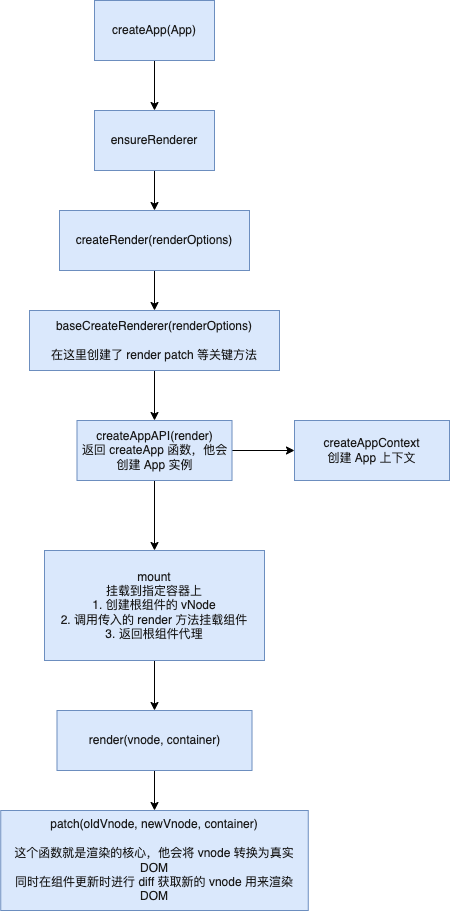

# 初始化
vue3 的项目从以下几行代码开始：
```js
import {createApp} from 'vue'
import App from './App.vue'

const app = createApp(App)
app.mount('#app')
```
从代码上看，首先创建了一个 app 实例，并提供一个根组件，然后挂载到 DOM 上
这个过程中发生了什么呢？

## 创建 app 实例
我们从 dom 平台的实现入手，在`runtime-dom`中定义了`createApp`方法
这个方法首先调用`ensureRenderer`

