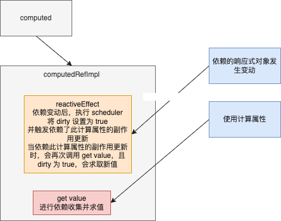
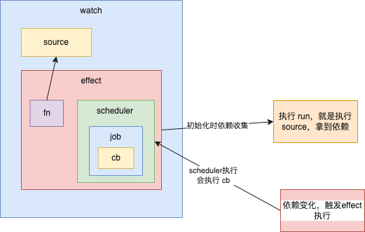
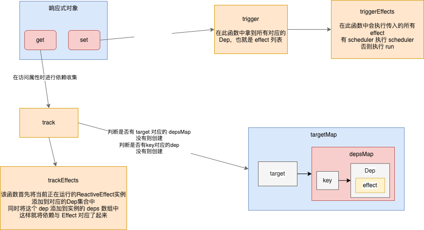

# 响应式原理
VUE3 的响应式使用了 Proxy 和 Reflect API，先学习一下这两个东西

## Proxy
Proxy 用于修改一些默认行为，属于元编程；可以理解成在目标对象上做一层包装，外界对对象的访问等操作都必须先通过拦截，因此用户可以在拦截的过程中对这些操作进行修改和其他操作

Proxy 构造函数接收两个参数
```js
new Proxy(target, handler)
```
target：目标对象
handler：拦截器
他会返回一个 Proxy 实例，这个实例代理了 target 的 handler 配置的操作

Proxy 支持的拦截操作：
- `get(target, propKey, receiver)`：拦截对象属性的读取
- `set(target, propKey, value, receiver)`：拦截对象属性设置
- `has(target, propKey)`：拦截`key in proxy`操作
- `deleteProperty(target, propKey)`：拦截`delete proxy[key]`
- `ownKeys(target)`：拦截`Object.getOwnPropertyNames(proxy)  Object.getOwnPropertySymbols(proxy) Object.keys(proxy)  for...in`
- `getOwnPropertyDescriptor(target, propKey)`：拦截`Object.getOwnPropertyDescriptor(proxy, propKey)`
- `defineProperty(target, propKey, propDesc)`：拦截`Object.defineProperty(proxy, propKey, peopDesc)  Object.defineProperties(proxy, propDescs)`
- `preventExtensions(target)`：拦截`Object.preventExtensions(proxy)`
- `getPrototypeOf(target)`：拦截`Object.getPrototypeOf(proxy)`
- `isExtensible(target)`：拦截`Object.isExtensible(proxy)`
- `setPrototypeOf(target, proto)`：拦截`Object.setPrototypeOf(proxy, proto)`
- `apply(target, object, args)`：拦截 Proxy 实例作为函数调用的操作 `proxy(...args) proxy.call(object, ...args)  proxy.apply(...)`
- `construct(target, args)`：拦截 Proxy 实例作为构造函数调用的操作

### Proxy 拦截方法
#### get
接收3个参数
- target： 目标对象
- key：属性名
- receiver：proxy实例本身对应的对象

[其他方法参考文档](https://www.bookstack.cn/read/es6-3rd/spilt.2.docs-proxy.md)

### this 问题
在 Proxy 代理的情况下，目标对象内部的 this 会指向 Proxy 代理
```js
const target = {
  m: function () {
    console.log(this === proxy);
  }
};
const handler = {};
const proxy = new Proxy(target, handler);
target.m() // false
proxy.m()  // true
```

有些原生对象的内部属性，只有通过正确的 this 才能拿到，所以 Proxy 也无法代理这些原生对象的属性
```js
const target = new Date();
const handler = {};
const proxy = new Proxy(target, handler);
proxy.getDate();
// TypeError: this is not a Date object.
```
通过绑定原始 this 对象，可解决：
```js
const target = new Date('2015-01-01');
const handler = {
  get(target, prop) {
    if (prop === 'getDate') {
      return target.getDate.bind(target);
    }
    return Reflect.get(target, prop);
  }
};
const proxy = new Proxy(target, handler);
proxy.getDate() // 1
```

## Refilect
该 API 的设计出于以下考虑：
1. 将 Object 对象的一些明显属于语言内部的方法（比如`Object.defineProperty`）放到`Reflect`对象上
2. 修改某些 Object 方法的返回结果，让其变得更合理，如`Object.defineProperty(obj, name, desc)`在无法定义属性时会抛出错误，而`Reflect.defineProperty(obj, name, desc)`则会返回 false
3. 让 Object 操作都变成 函数行为，某些 Object 操作是命令式的，如 in delete 等，用`Reflect.has()  Reflect.deleteProperty()`代替
4. Reflect 方法 与 Proxy 方法 一一对应

[ Reflect 方法的参考文档](https://www.bookstack.cn/read/es6-3rd/spilt.2.docs-reflect.md)


## 响应性API
vue3 中提供了 `reactive ref computed watch watchEffect`等API来定义响应式对象或使用响应式特性，我们从`reactive`入手，看看他们是怎么实现的

### reactive
`reactive` 定义在`reactivity`包内
`reactive`函数接收一个参数，就是要变成响应式的目标对象
首先判断对象是否是 readonly 的，是则原样返回，否则调用`createReactiveObject`，返回一个响应式对象

`createReactiveObject`接收5个参数：
- target：目标对象
- isReadonly：是否只读
- baseHandlers：提供给 Proxy 的对于普通对象的拦截器
- collectionHandlers：提供给 Proxy 的对于集合类对象的拦截器
- proxyMap：缓存响应式对象

首先判断对象类型，源码中通过`toString`返回值将对象分为三种类型：
- 普通对象
  - Object
  -  Array
- 集合对象
  - Map
  - Set
  - WeakMap
  - WeakSet
- 无效对象

然后生成一个 Proxy 实例，实例的拦截对象就是根据上文的对象类型来区分，首先看看普通对象的拦截器
普通对象使用`mutableHandlers`作为拦截器对象
```js
export const mutableHandlers: ProxyHandler<object> = {
  get,
  set,
  deleteProperty,
  has,
  ownKeys
}
```
主要拦截了以上5个操作

#### get
先来看看`get`，这个函数来自`createGetter`，其返回一个函数，就是`get`
get 的第一个多分枝语句判断了一些关于`reactive`的特殊`key`

接下来是数组的处理，对数组上的默认的8个方法都进行处理
其中又分为改变数组的和不改变数组的方法

对于普通对象，直接通过`Reflect.get`求值

如果不是只读属性，则通过`track`收集依赖，这部分之后再谈

最后则判断一下求得的值是否是`ref`和对象，对于`ref`对象，可进行自动展开处理，对于普通对象，则需要继续使这个对象具有响应性，这与vue2的在 init 阶段直接递归响应不同，能节省性能

对于集合的处理：todo

这就是对于`reactive`对象访问的处理，在访问属性时进行依赖收集

#### set
`set`来自`createSetter`
首先取得对应 key 的旧值
然后处理旧值是`ref`而新值不是的情况

然后通过`Reflect.set`设置值
接着判断是添加值还是修改值，调用`trigger`来派发更新


其他拦截器也是类似的处理，总之就是完成两个动作：依赖收集、派发更新

### ref
ref API 通过`createRef`实现，这个函数返回一个`RefImpl`实例
`RefImpl`实例又做了什么呢，当然还是依赖收集和派发更新
在构造函数内，调用`toReactive`来实现`_value`属性，基本类型直接返回，对象会返回`reactive`生成的结果

实例提供了`value`的`set get`
在 get 时，先进行依赖收集，然后返回`_value`属性
怎么进行依赖收集的呢？
调用`trackRefValue`方法，这个方法最终还是调用了`effect`的`trackEffects`，这部分在之后的章节介绍

在 set 时，先判断新值与旧值是否相同，发生变化才执行之后的操作
首先生成新的`_rawValue _value`属性
然后通过`triggerRefValue`派发更新，最终还是通过`triggerEffects`实现

### computed
计算属性，接收`setter getter`，返回一个`Ref`实例，在引用的响应式对象改变时自动求取新值
`computed`函数首先将`getter  setter`格式化，然后调用`ComputedRefImpl`，生成一个 Ref 实例

`ComputedRefImpl`做了什么呢？
首先，他的构造函数接收三个参数`getter setter isReadonly`，生成一个`ReactiveEffect`实例，`getter`是实例的`fn`即包装运行的函数，接着传入一个自定义`scheduler`，`scheduler`会在触发更新时被调用，首先设置计算属性的`_dirty`为`true`，然后调用`triggerRefValue`触发更新
计算属性实例有一个`value`的 get 属性，这就是我们使用计算属性时取值的方法
当调用`get value`时，会调用`trackRefValue`收集依赖，同时将计算属性的`_dirty`设置为`false`，然后执行副作用实例的`run`取得计算属性的值，并将值返回
也就是说，只有在访问计算属性时，才会去求值，这是懒求值


### watch
监听属性，设置要监听的响应式对象，并提供回调函数
`watch`函数通过`doWatch`来实现监听
首先，将提供的`source`进行验证，对不同形式的`source`进行处理获得`getter`
判断`deep`来决定是否调用`traverse`来递归监听所有属性
然后求得`oldValue`，第一次执行时是空数组或空对象

接着生成副作用实例的`scheduler`，其中包含对不同执行策略的处理
这个`scheduler`会调用`job`函数，`job`函数做了什么呢？
如果提供了`cb`那么就是一个正常的计算属性，如果没有提供`cb`，那么就是一个`watchEffect`
对于普通计算属性，首先调用副作用实例的`run`，取得`newValue`，对比新旧值决定是否执行`cb`（当然还有其他条件，分析基础功能时先忽略这些条件）
如果需要执行`cb`，这包装到错误处理函数中执行，执行完毕后`newValue`就变成了`oldValue`
对于`watchEffect`，只要直接执行副作用实例的`run`即可

到此就是监听属性的配置流程，但是我们应该发现了一个问题，那就是我们虽然提供了`getter`，但是还没有执行过他，依赖收集就没有进行过，上面的配置也就不会生效
接下来就需要一个初始化的流程进行依赖收集
首先判断`cb`是否存在来确定是普通`watch`还是`watchEffect`
如果是普通`watch`，且是立即执行，直接执行上文的`job`就行了，在调用`effect.run`的同时既能求取新值，也能进行依赖收集，如果不是立即执行的，直接调用`effect.run`只进行依赖收集就行了
如果是`watchEffect`那么就执行`source`就行了，`effect`包装的函数就是`source`，于是执行`effect.run`，即执行了`source`，也进行了依赖收集

当`source`中的依赖变化时，副作用实例会被触发重新执行，于是调用了`scheduler`，如上文所言`scheduler`调用`job`，`job`调用`cb`，对于`watchEffect`，`job`调用`effect.run`，这一套流程完成，就如下图所示：



## 副作用与响应式
在vue3中，要想你写的响应式API对象生效，那么你必须将你的代码包装成一个函数，然后作为`effect`函数的参数，通过调用`effect`，响应式API才能正常运行
那么`effect`做了什么呢？
查看其实现，发现其内部创建了一个`ReactiveEffect`实例，通过实例的运行来执行响应式

`ReactiveEffect`是一个对象，其构造函数接收三个参数：
- fn：要包装运行的函数
- scheduler：
- scope

这个对象最关键的地方就是他的`run`方法
在执行`run`时，会先设置`activeEffect`为当前实例，然后运行传入的函数，在执行包装函数时，如果函数中访问了响应式对象，则会触发`track or trackEffects`函数进行依赖收集
来看看这两个函数

`track` 函数负责梳理 Dep，数据的访问是`target.key`，因此他会先找到`target`对应的`depsMap`，没有则创建，然后找到`key`对应的`Dep`，同样是没有则创建
将 Dep 准备好后，传递给`trackEffects`
`trackEffects`函数负责将当前运行的副作用放到 dep 集合里
总结：我们在访问响应式对象的时候使用了`effect`包装，此时这个正在运行的`ReactiveEffect`实例就是`activeEffect`；访问的时候调用`track & trackEffects`这两个函数，他们会把当前的副作用实例添加到依赖集合，这样副作用实例就和响应式对象对应了起来

接下来看看更新的情况
以`set`为例，执行set 拦截器时会执行`trigger & triggerEffects`来派发更新，这两个函数做了什么呢？
我们的操作提供了`target & key`，`trigger`函数通过`target`拿到`depsMap`，再通过`key`拿到`deps`，`deps`是一个集合，存的就是`target.key`对应的副作用实例，这时，我们已经获取了所有对应的副作用实例，将他们传递给`triggerEffects`
`triggerEffects`会执行这些副作用实例的`run`方法（也可能是`scheduler`）
`run`方法会再次执行我们调用响应式对象的函数，完成了响应式对象改变重新执行函数调用，也就是派发更新



