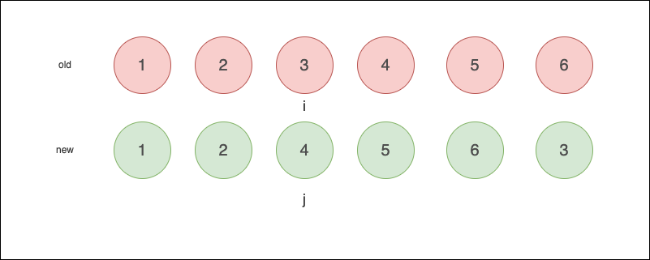
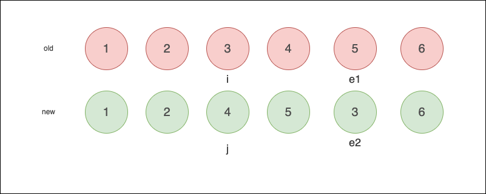
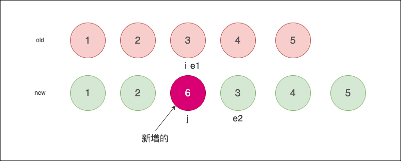
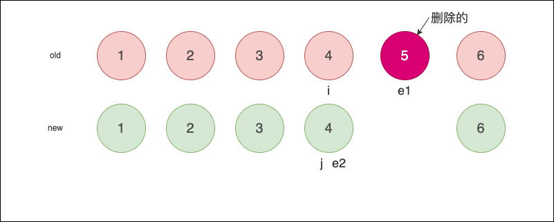
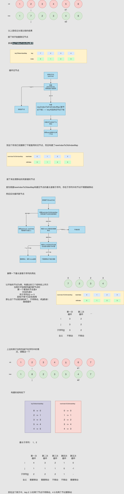
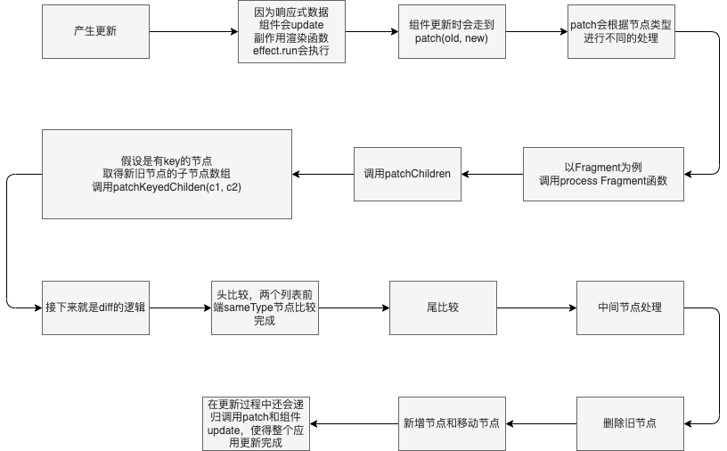

# 组件化
组件是 vue 的核心之一，是对 DOM 的抽象，你想定义什么样的页面结构或 DOM，只要定义为组件，通过组件在页面上渲染出来
组件是一个 js 对象，它包含了组件的基础配置、render 等属性，用来描述出抽象的页面
vue 对组件的处理必定要考虑以下几个方面：
- 通过组件的描述对象创建出组件实例
- 处理组件的状态
- 在组件的各个生命周期处理对应配置
- 处理组件配置的模版，生成 vnode 再生成 DOM
- 组件是可以嵌套的，处理多级组件的关系
- 组件是会更新的，处理更新后组件的状态

接下来一一讲解 vue 对组件的处理


## vnode
vue 在将 dom 渲染出来之前，使用 虚拟 DOM 描述他们，vnode 是一个js对象，他有很多属性，都是为了描述对应的 DOM 而存在
在源码里，通过`_createVNode`方法创建 vnode，他接受几个参数，包括：`type props children`等，其他参数不是核心参数，暂时先不考虑
在这个方法中，首先处理`type`，再处理`props`上的样式相关属性
然后调用`createBaseVNode`创建 vnode
这个方法接收几乎同样的参数，然后生成一个 `vNode`对象实例
接着处理`children`，最后返回该 vnode 对象实例


## 模版编译
与 vue2 类似，vue3 的编译也分为3个阶段
- ast
  - 将 template 编译成 ast
- transform
  - 转换 ast 处理为 vue 需要的格式，例如加上节点判断，渲染优化字段
- codegen
  - 生成 render 函数

## 组件render函数
在开发时，我们通常使用`.vue` or `.tsx`文件来定义组件，在`.vue`文件里，组件的模版部分是`<template>`标签部分的内容，而`tsx`文件中，我们一般通过`jsx`语法直接写`render`函数
但无论是哪种方式，都将编译成通过 vue API 实现的`render`函数
如果我们检查打包工具的打包结果，会发现，所有组件的`render`都会在 build 阶段生成，那么在项目代码运行时就不用去编译了，只需使用`runtime-only`版本
如下是一个组件的定义和编译结果：
```js
import { defineComponent } from 'vue'
import { useRoute, useRouter } from 'vue-router'
import { menus } from './config'
import styles from './styles.module.less'
export default defineComponent({
  props: [],
  components: {},
  setup(props) {
    const route = useRoute()
    const router = useRouter()

    const goto = (menu: any) => {
      router.push({ name: menu.routeName })
    }

    return () => (
      <div class={styles.main}>
        {menus.map((menu) => (
          <div
            class={`${styles.menuItem} ${
              route.name === menu.routeName ? styles.menuItemActive : ''
            }`}
            onClick={() => goto(menu)}
          >
            {menu.label}
          </div>
        ))}
      </div>
    )
  },
})


import { a as defineComponent, u as useRoute, b as useRouter, c as createVNode, r as resolveComponent } from "./index-a4f8e459.js";
const menus = [
  {
    routeName: "modelList",
    label: "模型列表"
  },
  {
    routeName: "modelEvaluate",
    label: "模型评价"
  }
];
const main = "_main_16qsj_1";
const menuItem = "_menuItem_16qsj_6";
const menuItemActive = "_menuItemActive_16qsj_13";
const styles = {
  main,
  menuItem,
  menuItemActive
};
const SideMenu = /* @__PURE__ */ defineComponent({
  props: [],
  components: {},
  setup(props) {
    const route = useRoute();
    const router = useRouter();
    const goto = (menu) => {
      router.push({
        name: menu.routeName
      });
    };
    return () => createVNode("div", {
      "class": styles.main
    }, [menus.map((menu) => createVNode("div", {
      "class": `${styles.menuItem} ${route.name === menu.routeName ? styles.menuItemActive : ""}`,
      "onClick": () => goto(menu)
    }, [menu.label]))]);
  }
});
```
可以看到，组件的`render`就是一个生成`vNode`的函数嵌套（根据组件模版），这是`jsx`的编译，通过插件实现，`template`是怎么实现的呢？
```js
<template>
    <div class={styles.main}>
        <div 
          v-for="menu in menus" 
          :class="styles.menuItem + (route.name===menu.routeName ? styles.menuItemActive : '') " 
          @click="()=> goto(menu)"
        >
          {{ menu.label }} aaaa
        </div>
    </div>
</template>

<script lang="ts">
import { defineComponent } from 'vue'
import { useRoute, useRouter } from 'vue-router'
import { menus } from './config'
import styles from './styles.module.less'
export default defineComponent({
    props: [],
    components: {},
    setup() {
        const route = useRoute()
        const router = useRouter()

        const goto = (menu: any) => {
            router.push({ name: menu.routeName })
        }

        return {
            route,
            goto,
            menus,
            styles
        }
    }
})
</script>


const _sfc_main = defineComponent({
  props: [],
  components: {},
  setup() {
    const route = useRoute();
    const router = useRouter();
    const goto = (menu) => {
      router.push({ name: menu.routeName });
    };
    return {
      route,
      goto,
      menus,
      styles: styles$2
    };
  }
});
const _export_sfc = (sfc, props) => {
  const target = sfc.__vccOpts || sfc;
  for (const [key, val] of props) {
    target[key] = val;
  }
  return target;
};
const _hoisted_1 = { class: "{styles.main}" };
const _hoisted_2 = ["onClick"];
function _sfc_render(_ctx, _cache, $props, $setup, $data, $options) {
  return openBlock(), createElementBlock(
    "div",
    _hoisted_1,
    [
      (
        openBlock(true),
        createElementBlock(
          Fragment,
          null,
          renderList(
            _ctx.menus,
            (menu) => {
              return openBlock(), createElementBlock(
                "div",
                {
                  class: normalizeClass(_ctx.styles.menuItem + (_ctx.route.name === menu.routeName ? _ctx.styles.menuItemActive : "")),
                  onClick: () => _ctx.goto(menu)
                },
                toDisplayString(menu.label) + " aaaa ",
                11,
                _hoisted_2
              );
            }
          ),
          256
        )
      )
    ]
  );
}
const sideMenu = /* @__PURE__ */ _export_sfc(_sfc_main, [["render", _sfc_render]]);
```

这是相同的组件，只不过使用了 vue3 提供的 编译器进行编译，但是我们可以发现他与上一个编译结果有明显的区别，这个`render`函数中的`vNode`好像是与`block`有关，而不是单纯的`createVNode`，那么这个`block`是什么呢？其实这是 vue3 中对虚拟节点

## 组件渲染
之前介绍过，在渲染时，使用的都是 vnode，我们在开发时肯定使用了组件，那么碰到 vnode 中有组件时会怎么处理呢
一般这部分处理都是在`patch`阶段
`patch`会根据 vnode 的 `type` 来区分普通元素、组件、内部组件、注释等，然后使用对应的手段处理他们
这一节我们只考虑组件的情况
对组件的处理通过`processComponent`实现，该函数中定义了初次渲染和更新时的处理，先看初次渲染
通过`mountComponent`方法挂载组件
首先获取组件实例，通过`createComponentInstance`创建组件实例，他的功能很简单，就是生成一个包含组件配置的一个对象实例，并返回该对象实例，其中组件实例的属性很多，但我们只要知道哪些功能对应哪些属性就比较好理解
接着调用`setupComponent`来设置`props solts`等属性，对于参数和插槽的处理在之后的章节介绍
同时在这个函数内还会调用组件的`setup`，一般他的返回值就是组件的`render`，这样就获得了组件的`render`

此时关于组件的所有静态的配置都已完成，接着就要处理组件渲染了，也就是对`render`的处理
`setupRenderEffect`函数基于组件实例创建一个 effect 来更新组件的内容
这个`effect`的`run`是`componentUpdateFn`，`scheduler`是`effect.run`

`componentUpdateFn`函数会针对组件的初次挂载和更新进行不同处理，先看初次挂载
会处理生命周期钩子
调用`renderComponentRoot`函数获取组件实例的`subTree`
`subTree`与`vNode`的区别是，vnode只是组件实例这一级的描述，而 subTree 是组件 render 结果的描述，包括 children 属性
拿到`subTree`后，调用`patch`，将`subTree`的内容继续渲染
通过递归调用`patch`最终将所有的组件都解析完毕，得到浏览器能渲染的原始标签结构，`patch`同样有一个分支会处理这些原始标签，将他们生成真正的 DOM，然后插入到页面上


## 组件更新

### diff
组件`diff`的过程定义在`patch`函数，`packages/runtime-core/src/renderer.ts`中的`setupRenderEffect/componentUpdateFn`函数实现组件渲染，我们主要关注更新时的流程：
```ts
let { next, bu, u, parent, vnode } = instance
let originNext = next
if (next) {
  next.el = vnode.el
  updateComponentPreRender(instance, next, optimized)
} else {
  next = vnode
}
const nextTree = renderComponentRoot(instance)
const prevTree = instance.subTree
instance.subTree = nextTree
patch(
  prevTree,
  nextTree,
  // parent may have changed if it's in a teleport
  hostParentNode(prevTree.el!)!,
  // anchor may have changed if it's in a fragment
  getNextHostNode(prevTree),
  instance,
  parentSuspense,
  isSVG
)
next.el = nextTree.el
```
可以看到首先取出组件示例的部分属性进行处理
然后重新渲染组件，获取新的`vnode`，称为`nextTree`，然后通过`patch`比较新旧节点

接下来看看`patch`的处理：
```js
const patch = (
  n1,
  n2,
  parentNode,
  nextSibling,
  instance
) => {
  const {type} = n2

  switch (type) {
    case Text:
      ...
    case Static: 
      ...
    case Fragment:
      processFragment
    default: 
      if (is_elememt) {
        processElement(...)
      } else if (is_component) {
        processComponent(...)
      } ...
  }
}
```
`patch`会根据节点类型进行不同的行为，包括字符节点、静态节点、元素、组件等
我们现在讨论`diff`，一般在多子节点的时候才会diff，会出现在`Fragment`和`Element`的情况下
来看看`Fragment`，`processFragment`会调用`patchBlockChildren or patchChildren`，
`patchBlockChildren`是一种优化，只比较动态的节点

根据`patchFlag`判断有没有`key`，走到不同的分支，一般一个组件的内容会作为一个`Fragment`且不会有key，`for`一般会设置key
`patchKeyedChildren`函数按步骤实现`diff`
1. 从两个列表头节点开始比较
   1. 如果两个节点是相同的，即`n1.type === n2.type && n1.key === n2.key`，将两个节点继续`patch`
   2. 如果不同，说明头比较结束，跳出这一阶段循环
   3. 
2. 当头比较结束时，进行尾比较
   1. 尾比较与头比较相同
   2. 
3. 头尾都比较完成后，剩下的就是不按顺序相等的节点
   1. 此时应就是以下情况
      1. 节点增加
      2. 节点删除
      3. 节点位置变化
   2. 节点增加
      1. 当旧节点列表已经比对完成时`i>e1`，因为`i j`是同步增加，所以值相同，`e1 e2`也是同步减小，所以偏移量也相同，如果此时新节点的`e2 >= i`，说明有新增的节点，那么就讲这些节点进行`patch`，对应的旧节点为`null`
      2. 
   3. 节点删除
      1. 当头尾比较结束后，`i>e2`，说明新节点比旧节点少，那么就是删除了节点，这些删除的节点就是`i~e1`之间的节点，卸载他们
      2. 
   4. 节点移动或乱序
      1. 这种情况比较复杂，首先新建一个集合`keyToNewIndexMap[key -> index]`保存新节点的`key -> index`
      2. 接下来要移除新节点中不存在的旧节点，在未比较过的节点间循环（`i||j  -> e1||e2`），过程如下：
         1. 按顺序拿到旧节点
         2. 判断`patched >= toBePatched`，为真说明新节点更新完毕，剩下的旧节点都要删除
         3. 获取该节点`key`对应的新节点的下标，即`keyToNewIndexMap`
            1. 如果没获取到下标，说明没有与之对应的新节点，这个节点要被删除，调用卸载函数
            2. 如果获取到下标
               1. 设置`newIndexToOldIndexMap[newIndex -> oldIndex]`，可复用节点的下标映射
               2. 判断`newIndex >= maxNewIndexSoFar`，为假说明新节点的位置产生了移动，设置`moved = true`
               3. 然后`patch`新节点和他可复用的节点，`patched++`
      3. 现在要删除的节点已经处理完毕，剩下的就是新增的和移动的
         1. 首先获取旧节点的最长递增子序列
         2. 循环中间段的新节点，从后往前：
            1. 拿到当前新节点
            2. 拿到当前节点的后一个节点，没有则获取父节点
            3. 根据`newIndexToOldIndexMap`判断是否是新增节点，是就`patch`，参数旧节点为`null`
            4. 如果需要移动(`move = true`)，则根据`increasingNewIndexSequence`进行判断，其原理是：新节点是从后往前遍历，`increasingNewIndexSequence`是可复用旧节点的最长递增子序列，即过滤出移动代价最小的可复用旧节点，同样从后往前匹配，因为新节点的顺序是我们需要的顺序，`increasingNewIndexSequence`提供的顺序满足这个顺序，只不过不是所有的节点，所以在同样从后往前匹配时，他一定是新节点的子集，且一旦第一次匹配上，接下来知道`increasingNewIndexSequence`消耗完都会匹配上
               1. 当匹配上时，不需要处理，源码中没有处理逻辑
               2. 当没匹配上时，需要移动，调用`move`函数
      4. 

总体流程图：
